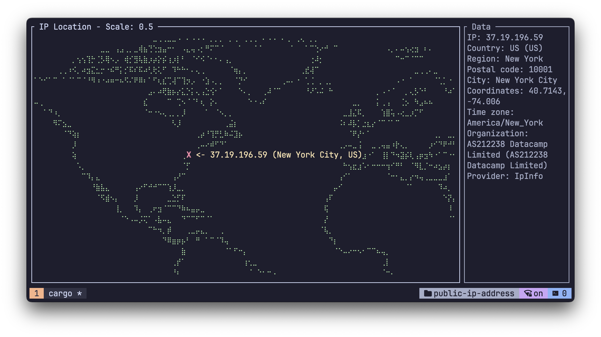

# 🔎 Public IP Address Lookup and Geolocation Information

<div align="center">
  
  [](https://crates.io/crates/public-ip-address)
  [](https://docs.rs/public-ip-address)
  
  

</div>



`public-ip-address` is a simple Rust library for performing public IP lookups from various services.

It provides a unified interface to fetch public IP address and geolocation information from multiple providers.

The library also includes caching functionality to improve performance for repeated lookups and minimize rate-limiting.

## Usage

Add the following to your `Cargo.toml` file:
```toml
[dependencies]
public-ip-address = { version = "0.1" }
```
## Example

The simplest way to use this library is to call the `perform_lookup()` function, which returns a `Result` with a `LookupResponse`.
```rust
use std::error::Error;

fn main() -> Result<(), Box<dyn Error>> {
    let result = public_ip_address::perform_lookup()?;
    println!("{}", result);
    Ok(())
}
```

More examples can be found in the `examples` directory. And run them with the following command:
```bash
cargo run --example <example_name>
```

## Providers

| Provider | URL | Rate Limit |
| --- | --- | --- |
| FreeIpApi | [https://freeipapi.com](https://freeipapi.com) | 60 / minute |
| IfConfig | [https://ifconfig.co](https://ifconfig.co) | 1 / minute |
| IpInfo | [https://ipinfo.io](https://ipinfo.io) | 50000 / month |
| MyIp | [https://my-ip.io](https://my-ip.io) | ? / day |
| IpApiCom | [https://ip-api.com](https://ip-api.com) | 45 / minute |
| IpWhoIs | [https://ipwhois.io](https://ipwhois.io) | 10000 / month |
| IpApiCo | [https://ipapi.co](https://ipapi.co) | 30000 / month |
| IpApiIo | [https://ip-api.io](https://ip-api.io) | ? / day |
| IpBase | [https://ipbase.com](https://ipbase.com) | ? / day |
| IpLocateIo | [https://ipbase.com](https://ipbase.com) | 50 / day |

## Roadmap

- [x] Initial release
- [x] Add more providers
- [ ] Add support for additional providers with API key
- [ ] Add reverse lookup feature
- [ ] Add asynchronous support

## License

Licensed under either of

 * Apache License, Version 2.0
   ([LICENSE-APACHE](LICENSE-APACHE) or http://www.apache.org/licenses/LICENSE-2.0)
 * MIT license
   ([LICENSE-MIT](LICENSE-MIT) or http://opensource.org/licenses/MIT)

at your option.

## Contribution

Contributions are welcome! Please submit a pull request.

## Support

If you encounter any problems or have any questions, please open an issue in the GitHub repository.
